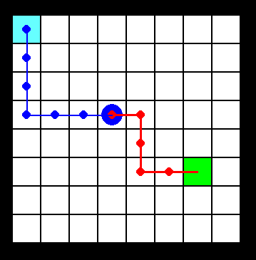

# Grid World for plan execution
This simle envrinment is used to test diferent environments for plan execution

## Grid World Representation

Grid World  of $n \times m$ where the start position is in the top left corner and the goal position is randomly generated in the right bottom $\lfloor n/2\rfloor  \times \lfloor m/2\rfloor$ corner area. Below we xhow a rendered example of an empty grid world where the green square marks the final goal, the light blue square marks the initial position and the large blue circle is the current position. The blue dotted lines represent the executed path and the red line represents the remaining plan steps. 

**actions**:
- Up
- Down
- Left
- Right

## Type of environment

- **Failure recovery**
  - **Non-deterministic action outcomes** include a 10% chance that any action results in a move to a random position within a 2 × 2 area centered on the current position.

  - **Unachievable plan state** modifies the problem instance to include a set of random obstacles on the map.
  
  

  - **Missing action** is simulated in our environment by removing one random action from the plan before sending it to the agent to be executed (the action can not be the first or last action of the plan).
  
  

  - **Combined Environment** combines all of the above. Two,minor changes are reducing the probability of moving to a random position 10% to 5% and he introduction of a probability of 10% of any action being missing from the plan.
  
- **Oportunistic Planning**